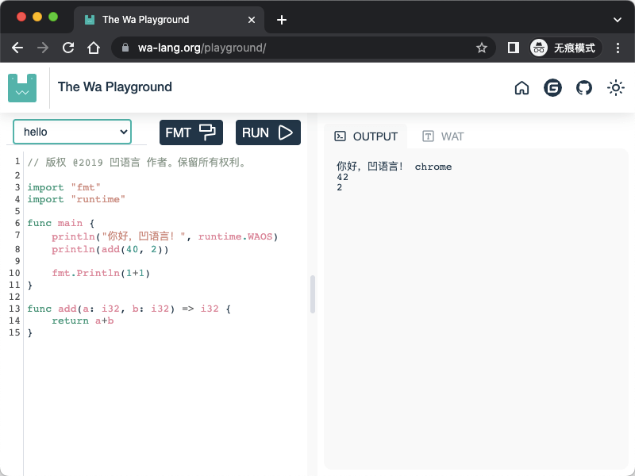

## 1.1. 你好，凹语言

打印“hello world”是C语言之后的惯用案例，凹语言例子打印的是中文“你好，凹语言！”。

### 1.1.1 你好，凹语言！

创建 hello.wa 文件，内容如下：

```wa
// 版权 @2019 凹语言 作者。保留所有权利。

import "fmt"
import "runtime"

global year: i32 = 2023

func main {
    println("你好，凹语言！", runtime.WAOS)
    println(add(40, 2), year)

    fmt.Println("1+1 =", 1+1)
}

func add(a: i32, b: i32) => i32 {
    return a+b
}
```

其中`//`开始的是行注释，`import`关键字导入了2个包准库的包，`global`关键字定义了一个全局变量，并给了2023的初始值。`func`关键字定义了`main`函数和`add`函数。`main`函数是程序的入口，其中通过内置的`println`函数打印了“你好，凹语言！”，同时使用`fmt`包的`Println`字符串和整数表达式的结果。在`main`函数还使用了全局的`year`变量，此外还调用了`add`函数并打印了返回值。`add`函数有2个输入参数和一个返回值。

如果在本地已经安装有凹语言的`wa`命令（安装方式参考1.2节），可以输入以下命令执行：

```
$ wa run hello.wa 
你好，凹语言！ wasi
42
1+1 = 2
```

### 1.1.2 在线的 Playground

凹语言是面向 WebAssembly 设计的通用编程语言，从诞生起就将浏览器作为第一支持目标。可以通过 [https://wa-lang.org/playground](https://wa-lang.org/playground) 访问 Playground，界面如下：



点击“RUN”按钮，可以看到输出结果。
